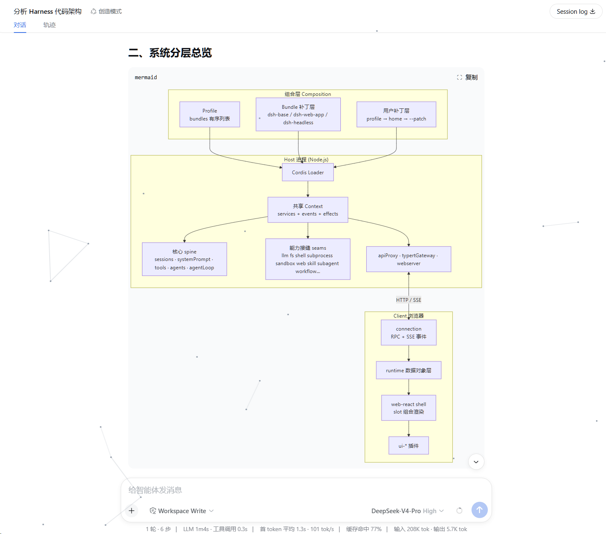
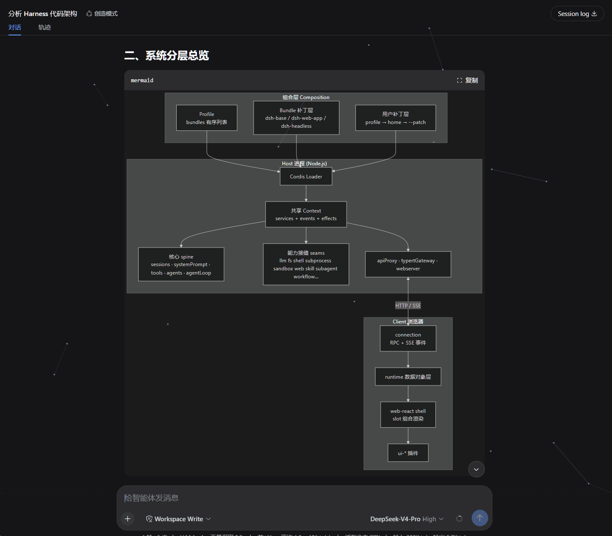
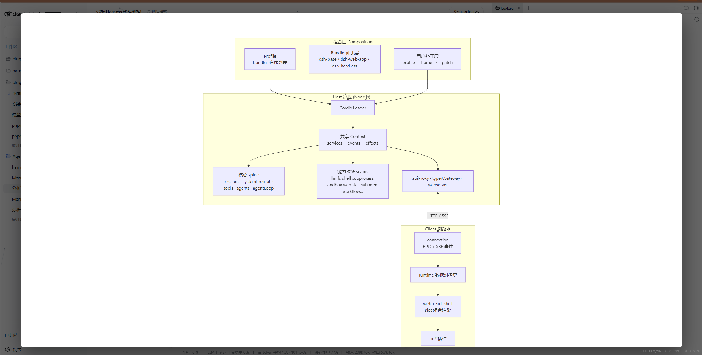
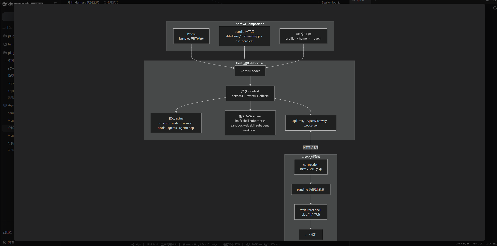

# dsh-mermaid

[中文](README.md)

A standalone plugin that renders ` ```mermaid ` code fences in DSH Web conversation messages as SVG diagrams. Install it into a web profile with `dsh plugin`.

## Preview

| Light theme · in conversation (not zoomed) | Dark theme · in conversation (not zoomed) |
| --- | --- |
|  |  |

| Light theme · zoom overlay | Dark theme · zoom overlay |
| --- | --- |
|  |  |

The zoom overlay auto-fits the diagram to the screen (near full-screen with a small margin), zooms with the mouse wheel, and pans by dragging with the left or middle button. With `theme: auto` the diagram colors follow the GUI light/dark theme.

## How it works

- **Host half** (`src/index.ts`): registers the `webServer` prefix route `/mermaid-dist`, lazily serves the mermaid UMD build from the plugin's own `node_modules/mermaid`, and exposes a fixed `config.json` endpoint.
- **Client half** (`src/client/`): watches the conversation DOM and renders fences whose infostring is `mermaid` to SVG:
  1. Only **settled** fences are processed (nothing renders mid-stream);
  2. The mermaid bundle is loaded lazily on first use (cached by the browser afterwards);
  3. **Viewport-driven rendering**: a fence only starts rendering when it scrolls into view (with a 300px preload margin) — render where you look; a diagram that leaves the viewport while queued or loading stops rendering and resumes on re-entry;
  4. **Async queue rendering**: with many diagrams they render one at a time and yield the main thread between renders, so the page never freezes; a loading placeholder is shown while a first render is in flight and is swapped for the SVG when done;
  5. `mermaid.render()` produces an SVG that replaces the fence's `<pre>` body; the language banner and copy button stay (copy still copies the source);
  6. `securityLevel` is always `strict`: labels are DOMPurify-sanitized by mermaid itself and click handlers are never bound;
  7. Theme follows the GUI: `theme: auto` reads `body[data-ds-dark-theme]` and re-renders **visible** diagrams when the attribute flips (offscreen diagrams refresh when they re-enter the viewport);
  8. The banner zoom button opens a **full-screen overlay**: the diagram is auto-fitted to the screen on open (near full-screen, centered, with a small margin), the wheel zooms relative to that size, **dragging with the left or middle button pans** at any zoom (clamped so the diagram can't be lost), and clicking the backdrop or pressing Esc closes it;
  9. **Visible render failures**: when a first render fails the source code block is kept and an error summary appears below it (long messages are truncated, hover for the full text), with one-click **copy the error** or **send to the AI to fix** (fills the report plus source into the input and sends it, simulating the user pasting the error to the AI).

The client package is ~10 KB (gzip ~4 KB); mermaid (~700 KB) is fetched on demand only when a mermaid fence actually appears — it never enters the boot graph.

## Install

From the GitHub repository (the build runs automatically in the `prepare` script):

```sh
dsh plugin --profile web add github:AKS1st/dsh-mermaid
dsh web   # restart the web service for the profile to take effect
```

> If pnpm reports that the git dependency needs to run build scripts (`ERR_PNPM_GIT_DEP_PREPARE_NOT_ALLOWED`),
> add the package to `allowBuilds` in the profile's `pnpm-workspace.yaml` and retry.

Local development (build first, then install):

```sh
npm install
npm run build
dsh plugin --profile web add .
dsh web
```

Uninstall:

```sh
dsh plugin --profile web remove @dsh-external/dsh-mermaid
```

## Configuration

The bundle applies this configuration by default:

```yaml
- insert:
    - id: mermaid
      name: '@dsh-external/dsh-mermaid'
      config:
        theme: auto
        maxTextSize: 50000
        maxEdges: 2000
        securityLevel: strict
```

| Key             | Default | Description |
| --------------- | ------: | ----------- |
| `theme`         | `auto`  | Diagram theme: `auto` (follows light/dark), `default`, `dark`, `neutral`, `forest`, `base` |
| `maxTextSize`   | 50000   | Per-diagram text cap (guards against oversized diagrams) |
| `maxEdges`      | 2000    | Edge-count guard |
| `securityLevel` | `strict`| Fixed to `strict`; `loose` is never accepted |

Override with `- set:` or `- update:` in the profile's `cordis.patch.yml`.

## Security model

- Assistant output is untrusted: `securityLevel` is locked to `strict`; HTML in labels is DOMPurify-sanitized by mermaid itself; `bindFunctions` is never called and click handlers stay inert.
- On a render failure the plain-text code block is kept (error HTML is never rendered), and an error summary appears below the block (copyable, or sendable to the AI to fix); the full error also goes to the console.

## Known limitations

- Depends on the host frontend `CodeBlock`'s stable hooks (the literal `md-code-block` class and the infostring text); selectors need to be kept in sync if the upstream renderer is refactored.
- Nothing renders during streaming; rendering happens after a message settles.
- Under `securityLevel: strict`, mermaid's click interactions are unavailable.
